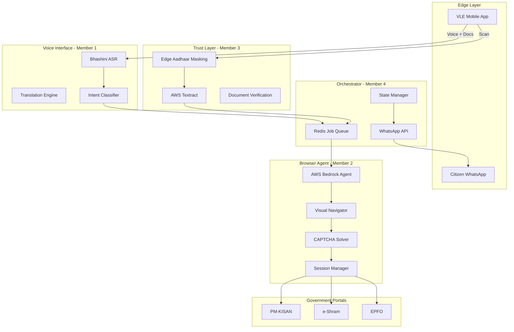

# GramSetu: Sovereign Agentic Infrastructure for Last-Mile Public Service Delivery

> **"From Information to Agency"** - An autonomous, voice-first, multimodal agentic system for rural India's digital transformation.

## 🎯 Project Vision

GramSetu (Village Bridge) transforms legacy government portals from "read-only" information sources into "read-write" APIs accessible through vernacular voice commands. It empowers Village Level Entrepreneurs (VLEs) at Common Service Centres (CSCs) to process complex government applications in seconds, not minutes.

## 🏗️ Architecture Overview



## 👥 Team Structure (4-Member Hackathon)

| Member | Role | Responsibility | Tech Stack |
|--------|------|----------------|------------|
| **Member 1** | Voice Architect | Vernacular ASR, Dialect Mapping, Intent Extraction | Bhashini, Sarvam AI, LangChain |
| **Member 2** | Agent Engineer | Browser Automation, Visual Navigation, CAPTCHA Solving | AWS Bedrock Agents, Playwright, Claude 3.5 |
| **Member 3** | Trust Architect | Privacy-Preserving OCR, PII Masking, DPDP Compliance | AWS Textract, OpenCV, Presidio |
| **Member 4** | System Orchestrator | State Management, Offline Sync, VLE UX, WhatsApp | Redis, FastAPI, React Native, SQLite |

## 🚀 Quick Start

### Prerequisites

- Python 3.11+
- Node.js 18+ (for mobile app)
- Docker & Docker Compose
- AWS Account with Bedrock access
- Bhashini API credentials
- Twilio/Meta WhatsApp Business API

### Installation

```bash
# Clone the repository
git clone <repository-url>
cd GramSetu

# Set up environment variables
cp .env.example .env
# Edit .env with your API keys

# Start infrastructure services
docker-compose up -d

# Install Python dependencies
pip install -r requirements.txt

# Install mobile app dependencies
cd mobile-app
npm install
```

### Running Individual Components

```bash
# Member 1: Voice Service
python -m services.voice.main

# Member 2: Agent Service
python -m services.agent.main

# Member 3: Document Service
python -m services.document.main

# Member 4: Orchestrator
python -m services.orchestrator.main
```

## 📁 Project Structure

```
GramSetu/
├── services/
│   ├── voice/              # Member 1: Voice Interface
│   ├── agent/              # Member 2: Browser Agent
│   ├── document/           # Member 3: Trust & Identity
│   └── orchestrator/       # Member 4: System Orchestration
├── mobile-app/             # React Native VLE App
├── shared/                 # Shared utilities and schemas
├── infrastructure/         # Docker, AWS configs
├── docs/                   # Documentation
└── tests/                  # Integration tests
```

## 🔑 Key Features

### 1. Voice-First Interface
- **Bhashini Integration**: Superior dialect recognition for 22+ Indian languages
- **Noise Suppression**: RNNoise for rural CSC environments
- **Intent Classification**: LLM-powered entity extraction

### 2. Autonomous Browser Agent
- **Visual Navigation**: Screenshot-based navigation immune to DOM changes
- **CAPTCHA Solving**: Multi-modal LLM for text, logic, and math CAPTCHAs
- **Session Recovery**: Auto-resume on timeouts with state preservation

### 3. Privacy-First Document Processing
- **Edge Masking**: On-device Aadhaar redaction (first 8 digits)
- **DPDP Compliance**: 24-hour auto-delete, encrypted storage
- **Consent Management**: Verbal consent recording with audit trail

### 4. Resilient Orchestration
- **Offline-First**: Local SQLite with burst sync
- **Job Queue**: Async processing with Redis
- **WhatsApp Notifications**: Direct citizen communication

## 🎯 Hackathon Execution Plan

### Sprint Schedule (24 Hours)

| Time | Member 1 | Member 2 | Member 3 | Member 4 |
|------|----------|----------|----------|----------|
| **00:00-04:00** | Bhashini wrapper | Playwright setup | OpenCV masking | Infra setup |
| **04:00-12:00** | Intent classifier | PM-KISAN driver | Textract integration | Mobile app UI |
| **12:00-18:00** | Latency optimization | Session recovery | Consent manager | Job queue |
| **18:00-22:00** | Integration testing | Integration testing | Integration testing | Integration testing |
| **22:00-24:00** | Demo polish | Visualization | Compliance docs | Dashboard |

### Demo Flow

1. **VLE speaks**: "Ramesh Kumar ka PM-Kisan status check karna hai" (Check Ramesh Kumar's PM-KISAN status)
2. **System responds**: "Aadhaar card dikhayein" (Show Aadhaar card)
3. **VLE scans** masked Aadhaar card
4. **Agent navigates** PM-KISAN portal autonomously
5. **System sends** WhatsApp notification to Ramesh with status

## 📊 Business Model

### Unit Economics

| Metric | Current (Manual) | With GramSetu |
|--------|------------------|---------------|
| Time per application | 20 minutes | 2 minutes |
| VLE hourly revenue | ₹60 | ₹600 |
| GramSetu fee | - | ₹2/transaction |

### Go-to-Market

1. **Phase 1**: Beta with 50 VLEs in one district
2. **Phase 2**: CSC SPV partnership for national rollout
3. **Phase 3**: Expand to banking, healthcare services

## 🔒 Compliance & Security

- **DPDP Act 2023**: Data minimization, purpose limitation, ephemeral storage
- **Encryption**: TLS 1.3 in transit, AWS KMS at rest
- **Audit Trail**: Timestamped consent artifacts
- **Grievance Redressal**: WhatsApp-based complaint mechanism

## 🛠️ Technology Stack

### Backend
- **Python 3.11**: Core services
- **FastAPI**: REST APIs
- **Redis**: Job queue and caching
- **PostgreSQL**: Persistent storage

### AI/ML
- **AWS Bedrock**: Agent orchestration
- **Claude 3.5 Sonnet**: Multimodal reasoning
- **Bhashini**: Speech recognition
- **AWS Textract**: Document OCR

### Frontend
- **React Native**: Mobile app
- **Expo**: Development tooling
- **RxDB**: Offline-first database

### Infrastructure
- **Docker**: Containerization
- **AWS**: Cloud hosting
- **GitHub Actions**: CI/CD

## 📚 Documentation

- [API Reference](docs/api-reference.md)
- [Bhashini Integration Guide](docs/bhashini-integration.md)
- [AWS Bedrock Setup](docs/bedrock-setup.md)
- [Privacy Compliance](docs/privacy-compliance.md)
- [Deployment Guide](docs/deployment.md)

## 🤝 Contributing

This is a hackathon project. For the competition period, contributions are limited to the 4-member team. Post-hackathon, we welcome community contributions.

## 📄 License

[To be determined post-hackathon]

## 🙏 Acknowledgments

- **Bhashini**: National Language Translation Mission
- **AWS**: Bedrock Agent platform
- **CSC SPV**: Common Service Centre network
- **AI for Bharat**: Hackathon organizers

---

**Built with ❤️ for Bharat's 900 million rural citizens**
